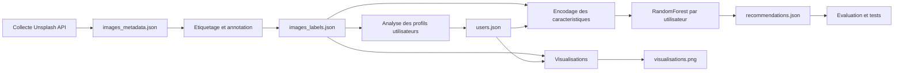
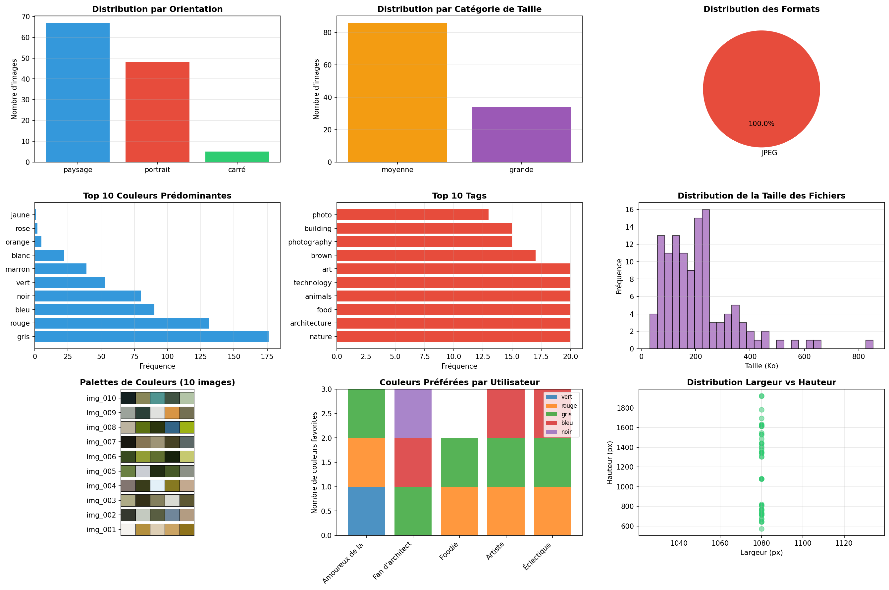

# Page de garde

## Donnees Massives - Projet

### Systeme de recommandation d'images

**Partie 1 - Rapport de synthese**

**Equipe :** BONNET & DURANO  
**Cours :** Donnees Massives  
**Annee academique :** 2025-2026  
**Date :** Mars 2026

---

\newpage

# Sommaire

1. [Introduction](#1-introduction)
2. [Collecte de donnees](#2-collecte-de-donnees)
3. [Methodologie](#3-methodologie)
4. [Resultats](#4-resultats)
5. [Limites et travaux futurs](#5-limites-et-travaux-futurs)
6. [Conclusion](#6-conclusion)
7. [References](#references)

---

\newpage

# Rapport de synthese - Systeme de recommandation d'images (Partie 1)

## 1. Introduction

Ce projet a pour objectif de concevoir un systeme de recommandation d'images capable de proposer des contenus pertinents a des utilisateurs en fonction de leurs preferences visuelles et thematiques. La finalite est double :

- mettre en pratique les competences acquises en collecte de donnees, analyse, visualisation et machine learning ;
- produire un pipeline complet, de l'acquisition des images jusqu'a la recommandation expliquee.

Notre approche a ete de construire un workflow monolithique dans un notebook Jupyter, organise en 6 taches fonctionnelles : collecte, etiquetage, analyse utilisateur, visualisation, recommandation et tests. Nous avons privilegie une strategie reproductible et interpretable :

- acquisition automatisee via une API ouverte (Unsplash) ;
- extraction de caracteristiques simples mais informatives (couleurs dominantes, orientation, taille, tags) ;
- construction de profils utilisateurs simules ;
- recommandation basee sur le contenu avec un classifieur supervisé ;
- validation par des tests d'integrite, fonctionnels et de qualite.

Le systeme obtenu couvre l'ensemble du cahier des charges de la partie 1 et fournit en plus un niveau d'explicabilite (raison textuelle par recommandation) ainsi qu'un jeu de visualisations de synthese consolide.

## 2. Collecte de donnees

### 2.1 Sources et licences

Les images ont ete recuperees via l'API Unsplash, avec une licence uniforme :

- source : Unsplash API ;
- licence : Unsplash License ;
- format dominant : JPEG.

Pour garantir une base de donnees variee, la collecte a ete equilibree sur 6 requetes thematiques, chacune avec 20 images :

- nature ;
- architecture ;
- food ;
- art ;
- technology ;
- animals.

### 2.2 Volume collecte

Le dataset final contient :

- 120 images (objectif minimal depasse : 100+) ;
- 120 entrees de metadonnees ;
- 120 entrees de labels enrichis.

### 2.3 Metadonnees stockees

Chaque image est decrite par un ensemble de champs structurels et contextuels :

- identifiant de fichier ;
- dimensions (largeur, hauteur) ;
- format ;
- taille du fichier en Ko ;
- URL source et URL de telechargement ;
- informations d'auteur ;
- informations textuelles (description, alt description, requete source) ;
- informations de licence ;
- bloc EXIF (quand disponible).

Observation importante : dans cette collecte, l'API Unsplash retourne principalement des JPEG optimises, avec peu de metadonnees EXIF exploitables. Cette contrainte a ete prise en compte dans la suite du pipeline.

## 3. Methodologie

### 3.1 Vue d'ensemble

Le pipeline suit une logique progressive :

1. Acquisition automatisee et persistance JSON.
2. Enrichissement des images par extraction de caracteristiques.
3. Construction de profils utilisateurs a partir de favoris.
4. Encodage des caracteristiques pour apprentissage supervise.
5. Generation de recommandations personnalisees avec justification.
6. Verification de la robustesse par tests.

### 3.2 Approche d'etiquetage

L'etiquetage combine des signaux visuels (pixels) et des signaux semantiques (tags source).

#### Couleurs predominantes

Pour chaque image, nous extrayons 3 a 5 couleurs dominantes par regroupement KMeans sur l'espace RGB. Les centres des clusters fournissent des triplets numeriques convertis ensuite en noms de couleurs interpretable (ex. gris, rouge, bleu).

#### Orientation

Classification geometrique directe :

- paysage si largeur > hauteur ;
- portrait si hauteur > largeur ;
- carre si dimensions proches.

Resultat observe sur 120 images :

- paysage : 67 ;
- portrait : 48 ;
- carre : 5.

#### Categorie de taille

Les dimensions permettent de categoriser les images en classes de taille. Dans le jeu final :

- moyenne : 86 ;
- grande : 34.

#### Tags

Les tags sont majoritairement derives des informations de la source Unsplash (approche automatisee/hybride). Le top de frequence confirme un corpus bien reparti entre les 6 themes choisis.

### 3.3 Construction du profil utilisateur

Nous avons simule 5 utilisateurs aux preferences heterogenes :

- Amoureux de la nature ;
- Fan d'architecture ;
- Foodie ;
- Artiste ;
- Eclectique.

Pour chacun, un profil est construit a partir des favoris (10 a 17 images par utilisateur, 72 favoris au total), en agregeant :

- couleurs favorites ;
- orientation dominante ;
- taille favorite ;
- tags les plus frequents ;
- liste de favoris.

Cette representation compacte constitue l'entree du moteur de recommandation.

### 3.4 Algorithme de recommandation choisi

Nous avons retenu l'option A (filtrage base sur le contenu), via un RandomForestClassifier entraine par utilisateur.

Raisons du choix :

- bonne performance sur variables heterogenes et encodees ;
- robustesse au bruit et aux interactions non lineaires ;
- mise en oeuvre simple dans un flux notebook ;
- possibilite de produire des scores de pertinence et des explications.

Sortie du systeme :

- 5 recommandations par utilisateur (25 recommandations au total) ;
- exclusion des images deja en favoris ;
- score de similarite ;
- raison textuelle (couleurs, orientation, tags correspondants).

### 3.5 Diagramme d'architecture

## 4. Resultats

### 4.1 Figures principales

Figure 1 - Architecture du projet (reference globale):

Figure 2 - Tableau de bord des visualisations produites (9 graphiques) :

Les visualisations couvrent notamment :

- distributions par orientation, taille et format ;
- histogrammes de couleurs dominantes ;
- top tags ;
- distribution des tailles de fichier ;
- palettes de couleurs ;
- preferences par utilisateur ;
- relation largeur/hauteur.

### 4.2 Qualite et precision des recommandations

Le modele de recommandation est evalue via une validation 80/20, avec un suivi par utilisateur. La precision (accuracy) observee est comprise entre 80.56% et 88.89%, pour une moyenne d'environ 86.11%.

En complement, les scores de recommandations generes sont coherents avec les profils :

- score minimal observe : 0.23 ;
- score maximal observe : 0.52 ;
- score moyen observe : 0.3483.

Les tests de la tache 6 sont tous valides, y compris :

- integrite des donnees ;
- validite des fonctions ;
- qualite des recommandations (non redondance avec les favoris et coherence preference/recommandation).

Les elements d'evaluation de la qualite des recommandations ont ete verifies explicitement sur un scenario de test utilisateur, avec les controles suivants :

- nombre de recommandations conforme (Top-5 genere) ;
- aucune image deja en favoris n'est recommandee ;
- tri des recommandations en scores decroissants ;
- pertinence mesuree a 100.0% sur le test (toutes les recommandations correspondent au profil utilisateur attendu).

Cette double lecture (metriques de precision + validation fonctionnelle de la qualite des sorties) renforce la fiabilite du systeme dans le cadre de la partie 1.

### 4.3 Observations interessantes

- Le dataset est tres homogene en format et largeur (JPEG, largeur 1080 px), mais varie en hauteur (573 a 1922 px), ce qui cree une variabilite suffisante pour l'orientation.
- Les couleurs dominantes globales sont principalement neutres/froides (gris, rouge, bleu, noir), ce qui influence naturellement les profils.
- La repartition thematique equilibree (20 images par theme) facilite la simulation de profils utilisateurs differencies et la production de recommandations non triviales.

### 4.4 Ce qui a ete fait en plus

Au-dela du minimum attendu, plusieurs elements supplementaires ont ete realises :

- 120 images collectees (au lieu du minimum 100) ;
- 9 visualisations consolidees (minimum demande : 6) ;
- explication textuelle explicite pour chaque recommandation ;
- export structure des resultats en fichiers JSON distincts (metadonnees, labels, profils, recommandations) ;
- suivi de precision par utilisateur et non uniquement global.

## 5. Limites et travaux futurs

### 5.1 Limites

- Dependance a une source unique (Unsplash), avec faible richesse EXIF exploitable.
- Utilisateurs simules, donc absence de vrai feedback comportemental (clics, temps de vue, historique reel).
- Features essentiellement categoriales/simples ; absence de descripteurs visuels profonds.
- Evaluation encore majoritairement centree sur la precision de classification et des tests fonctionnels ; absence de metriques de ranking plus specialisees (Precision@K, Recall@K, NDCG).

### 5.2 Ameliorations proposees

- Integrer de nouvelles sources (Wikimedia, Flickr, Pexels) pour enrichir diversite et licences.
- Ajouter des embeddings visuels (CNN pre-entraine) pour mieux capturer la similarite semantique.
- Introduire une boucle de feedback utilisateur reel et une mise a jour continue des profils.
- Evaluer avec des metriques de ranking et un protocole offline plus complet.
- Comparer plusieurs modeles (SVM, gradient boosting, hybride contenu + clustering).

## 6. Conclusion

Cette partie 1 a permis de livrer un systeme de recommandation d'images de bout en bout, fonctionnel et valide, couvrant l'acquisition, l'enrichissement, l'analyse utilisateur, la recommandation et les tests. Le projet atteint les objectifs pedagogiques principaux en combinant methodes de data science, visualisation et apprentissage supervise.

Auto-evaluation : le resultat est solide sur la chaine de traitement et la reproductibilite, avec des performances de precision encourageantes. Les marges de progression se situent surtout sur la sophistication des caracteristiques visuelles, la qualite de l'evaluation orientee recommandation et l'exploitation de donnees utilisateurs reelles.

## References

1. Unsplash API Documentation, https://unsplash.com/documentation
2. Scikit-learn - RandomForestClassifier, https://scikit-learn.org/stable/modules/generated/sklearn.ensemble.RandomForestClassifier.html
3. Scikit-learn - KMeans, https://scikit-learn.org/stable/modules/generated/sklearn.cluster.KMeans.html
4. Pillow (PIL) Documentation, https://pillow.readthedocs.io/
5. Matplotlib Documentation, https://matplotlib.org/stable/
6. Pandas Documentation, https://pandas.pydata.org/docs/